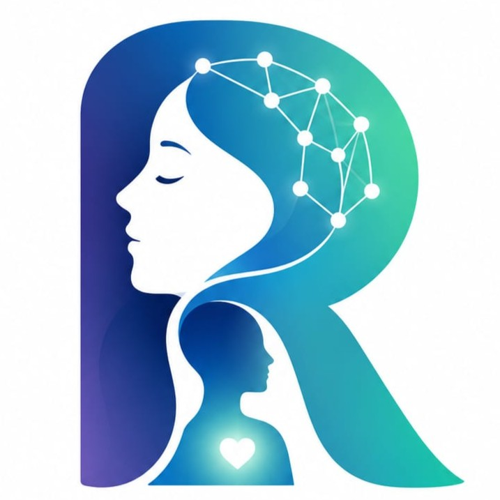

# RonaAtma: Portal Konseling Siswa Berbasis AI & Keamanan Privasi Desentralisasi

<p align="center">
  
</p>

<p align="center">
  
  
  
  
  
  
</p>

RonaAtma adalah platform kesehatan mental dan bimbingan konseling digital modern yang dirancang khusus untuk siswa SMA di Indonesia. Sistem ini berfungsi sebagai "Sanctuary" (ruang aman) yang menjembatani keterbatasan jumlah Guru BK di sekolah, membantu mengatasi stres akademik, serta memberikan perlindungan penuh terhadap korban perundungan (*bullying*) dengan mengintegrasikan kecerdasan buatan (AI) empati dan privasi kriptografis desentralisasi.

---

## 🌌 Fitur Utama & Inovasi

### 1. Hub Terpadu RonaAtma.AI
Penggabungan utuh antara ruang obrolan teks dan panggilan suara dalam satu halaman interaktif.
* **Smart Input Switching:** Kolom input secara dinamis berubah fungsi. Tombol berubah menjadi **Kirim Pesan** (jika ada teks yang diketik) dan otomatis berubah menjadi **Panggilan Suara (Mic)** jika kolom input kosong.
* **Sinkronisasi Riwayat:** Transkrip obrolan selama sesi panggilan suara akan otomatis terarsip dan langsung masuk ke riwayat chat teks setelah panggilan diakhiri, memungkinkan siswa membaca ulang respon AI kapan saja.

### 2. Penyamaran Suara Dua Jalur (*Dual-Stream Voice Masking*)
Sistem keamanan biologis tingkat tinggi untuk menghilangkan ketakutan siswa bahwa suara asli mereka akan direkam atau dikenali oleh admin server.
* **Proses Lokal 100% (Client-Side):** Modifikasi audio diproses langsung di browser menggunakan Web Audio API tanpa melibatkan GPU eksternal.
* **Arsitektur Dual-Stream:**
  * **Jalur Asli (Original Stream):** Dikirim ke MediaRecorder lokal untuk diteruskan ke AI STT agar transkripsi Whisper tetap akurat sebesar **98%**.
  * **Jalur Samaran (Masked Stream):** Nada, frekuensi, dan warna suara dimodifikasi secara real-time lalu dihubungkan ke visualizer Orb. Suara asli **tidak pernah** meninggalkan perangkat siswa.

### 3. Siri Quantum Fluid Orb Visualizer
* Menggantikan visual wajah 2D statis dengan visualisasi fluida dinamis berbasis sinyal sinus/Bezier ganda pada elemen Canvas HTML5, bergerak responsif seirama dengan amplitudo mic (siswa) dan speaker (AI).

### 4. Sistem Peringatan Dini (*Early Warning System*) & Dashboard BK
* **Pemetaan Stres Kolektif:** Sistem melacak stabilitas emosional harian siswa melalui Mood Tracker.
* **Alarm Darurat:** Jika AI mendeteksi penurunan kestabilan mental secara drastis dalam 3 hari berturut-turut atau adanya indikasi krisis verbal, sistem otomatis mengirim notifikasi terenkripsi rahasia ke akun Guru BK untuk penanganan dini.

---

## 🛠️ Bahasa Pemrograman & Arsitektur Teknologi

* **Bahasa Pemrograman & Skrip:**
  * **Motoko (`.mo`):** Digunakan untuk membangun kontrak pintar (*Canister Smart Contract*) di jaringan **Internet Computer Protocol (ICP)** untuk manajemen salt enkripsi identitas samaran (*pseudonym*) siswa secara terdesentralisasi.
  * **TypeScript / TSX:** Logika inti aplikasi React, sistem navigasi, hooks audio, dan manajemen state.
  * **TypeScript (Deno Runtime):** Bahasa skrip untuk Supabase Serverless Edge Functions backend.
  * **SQL (PostgreSQL PL/pgSQL):** Desain skema database, kebijakan keamanan baris (RLS), dan pemicu (*database triggers*).
  * **CSS3:** Kustomisasi visual gaya *cyber-cosmic* dan transisi layout responsif.
  * **HTML5:** Struktur layout utama.
* **Kerangka Kerja (Framework) & Pustaka:** React (v18), Vite, Tailwind CSS, Lucide Icons, Recharts.
* **Infrastruktur Backend:** Supabase (Autentikasi, PostgreSQL, Realtime Database, Edge Functions).
* **Integrasi Jalur AI (Edge Functions):**
  * **STT (Speech-to-Text):** OpenAI Whisper Large v3.
  * **LLM Completions:** Groq Llama-3/Qwen dengan penyesuaian gaya bahasa gaul remaja Indonesia.
  * **TTS (Text-to-Speech):** ElevenLabs Multi-Key Rotation Pipeline (dilengkapi fallback otomatis ke Web Speech API lokal jika limit API key ElevenLabs habis).

---

## 📂 Struktur Direktori Proyek

```text
├── icp/                      # Integrasi Internet Computer Protocol
│   ├── src/
│   │   ├── main.mo           # Logika utama Canister Smart Contract (Motoko)
│   │   └── types.mo          # Struktur tipe data Motoko
│   └── dfx.json              # Konfigurasi DFX ICP SDK
├── supabase/
│   ├── functions/
│   │   ├── chat-ai/          # LLM completions + deteksi sinyal krisis
│   │   ├── speech-to-text/   # Endpoint Whisper v3
│   │   └── text-to-speech/   # Mesin rotasi multi-kunci ElevenLabs
│   └── config.toml
├── src/
│   ├── components/
│   │   ├── layout/
│   │   │   ├── AppLayout.tsx # Kontainer responsif global (guard anti-overflow mobile)
│   │   │   └── Sidebar.tsx   # Menu samping & navigasi bawah handphone
│   │   └── AvatarCounselor.tsx # Visualisasi Quantum Fluid Orb Canvas
│   ├── hooks/
│   │   └── useAudioEngine.ts # Mesin perekam, pemutar, VAD, & penyamaran suara
│   ├── pages/
│   │   ├── student/
│   │   │   ├── Dashboard.tsx # Beranda Sanctuary Siswa
│   │   │   ├── MoodTracker.tsx # Pencatatan jurnal harian & analisis AI
│   │   │   ├── RonaAtmaAI.tsx # Obrolan teks & panggilan suara RonaAtma.AI terpadu
│   │   │   └── BullyingReport.tsx # Bilik Curhat pelaporan anonim blockchain
│   │   └── dashboard/        # Dashboard Guru BK (BK View)
│   ├── App.tsx               # Konfigurasi routing aplikasi
│   └── index.css             # Penjaga overflow global, scrollbar kustom, & tema kartu
```

---

## 🚀 Panduan Menjalankan di Lokal

### Prasyarat
* [Node.js](https://nodejs.org/) (v18+ direkomendasikan)
* [Supabase CLI](https://supabase.com/docs/guides/cli) (untuk Edge Functions lokal)
* [DFX SDK](https://internetcomputer.org/docs/current/developer-docs/getting-started/install/) (opsional, jika ingin mendeploy canister ICP lokal)

### 1. Instalasi Dependensi
Unduh repositori dan instal dependensi pustaka npm:
```bash
git clone <url-repositori-anda>
cd RonaAtma
npm install
```

### 2. Konfigurasi Environment
Buat berkas `.env` di root direktori proyek:
```bash
VITE_SUPABASE_URL=url_proyek_supabase_anda
VITE_SUPABASE_ANON_KEY=kunci_anon_publik_supabase_anda
```

### 3. Jalankan Server Pengembangan
Jalankan server lokal dengan fitur hot-reload:
```bash
npm run dev
```
Buka `http://localhost:5173` (atau port lain yang tertera di konsol) pada browser Anda.

---

## 🔒 Panduan Deploy Produksi

### Mengunggah Secrets Supabase (API Keys ElevenLabs)
Deploy kunci utama ElevenLabs beserta kunci cadangan ke secrets cloud Supabase:
```bash
npx supabase secrets set ELEVENLABS_API_KEY="kunci1,kunci2,kunci3"
```

### Pengecekan Kesalahan Ketik & Kompilasi
Lakukan pemeriksaan tipe data TypeScript dan uji proses build sebelum melakukan deploy:
```bash
npm run typecheck
npm run build
```

---

## 🛡️ Kepatuhan Regulasi Hukum (UU PDP No. 27 Tahun 2022)
RonaAtma mematuhi secara ketat regulasi **Undang-Undang No. 27 Tahun 2022 tentang Pelindungan Data Pribadi (UU PDP)** di Indonesia:
1. **De-identifikasi Data:** Seluruh data identitas asli siswa (Nama, Kelas, NISN) dipotong secara kriptografis dari data transkrip curhat di database.
2. **Persetujuan Sukarela (*Informed Consent*):** Pengambilan sampel data suara maupun teks memerlukan aksi persetujuan eksplisit dari siswa sebelum sesi dimulai.
3. **Keamanan Biometrik:** Suara asli diubah bentuknya secara lokal di client-side (*voice masking*) sebelum dianalisis, sehingga rekaman suara biologis asli tidak pernah disimpan atau bocor di server bimbingan konseling.
